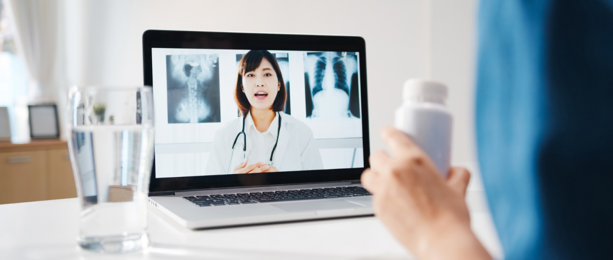

Equitable distribution of healthcare to the 121-crore population of India is not a simple mission. Despite progress over the decades and the special attention the sector gains, the geographic and socio-economic inequalities still persist. It doesn’t help when we have 68% of the population still residing in Rural India. Telemedicine offers the possibility of increasing accessibility and availability of doctors and helps overcome geographic restrictions. It provides a direct impact in flattening the demand curve of the healthcare systems and infrastructures. Covid-19 outbreak challenged the Indian system and has brought the cracks in the traditional systems to the surface. Due to the lock-down, physical consultations were simply not a feasible option. The dire situation has led the government to update the regulations in the telemedicine space wrt services being provided via video and audio. In October 2020, even IRDAI has allowed insurance companies to adjust claim settlements for telemedicine consultation treating; it's the same as normal consultation with a medical practitioner.

With a Telemedicine Pilot Project linking Chennai's Apollo Hospital with the Apollo Rural Hospital at Aragonda village in the Chittoor district of Andhra Pradesh in 2001, ISRO (Indian Space Research Organization) was the first to introduce telemedicine in India.

Telemedicine Practice Guidelines were published by the Medical Council in partnership with NITI Aayog last year in March 2020. It spells out how transmission of voice, data, images, and information should be used in conjunction with other clinical standards, protocols, policies, and procedures for the provision of the right care. The documentation is also expected to help realize the full potential of the advancements in technology for health care delivery.

The Indian Medical Council Act 1956 requires a Registered Medical Practitioner (RMP) to be enrolled in either the State Medical Register or the Indian Medical Register. The guidelines explicitly exclude among other consultations the following which are of our interest areas:

Surgical or invasive treatments should not be performed with digital technologies.
There are no provisions for consultations outside of India's jurisdiction.

To allow RMPs to become acquainted with these guidelines, as well as the method and constraints of telemedicine practice, training in the new-age technologies must be provided.

Telemedicine applications can be divided into four categories, depending on their purpose.

Communication mode
The transmission of the information at a specific time
The consultation's goal
Interaction between the participants: RMP-to-patient/caregiver or RMP-to-RMP

These seven things should be considered during a Telemedicine consultation in India.

### Context:

Telemedicine should be acceptable and adequate for the situation.
RMP and patient identification: For the sake of transparency, both parties should know each other's names, e-mail addresses, and addresses.
Mode of Communication: The strengths and weaknesses of audio, video, text and other forms of communication should be considered in light of the situation.
Consent: In the instance of a mentally sound adult who starts consultation, consent can be 'implied.' When a health worker, RMP, or caregiver initiates the consultation, it can be 'Explicit.' The patient can send an e-mail, text, or audio/video message to the RMP declaring his or her purpose for explicit content. This must be noted in the RMP's patient records.
Consultation type:
When a patient consults the RMP for the first time for the current health problem, or has consulted with the RMP more than 6 months ago for the same health condition, or has consulted with the RMP previously, but for a different health condition.
Follow-up consults: When a patient contacts the same RMP for the same health concern within 6 months of a previous in-person appointment. It will not be considered follow-up if the RMP fails to recall the context of past treatment and guidance in the presence of new symptoms that are not in the same health condition's range.
Patient evaluation: Before making any professional judgments, RMPs must collect all medical facts concerning the patient's condition.
Patient management: If the disease can be managed by telemedicine, the RMP can make a professional decision to provide health education and counselling, as well as prescribe medications through a properly signed e-prescription.
There is a specific limitation with respect to the medicines that can be prescribed via teleconsultation.

> _The following are the types of drugs that can be prescribed:_

### List O:
Can be prescribed by teleconsultation in any mode and included 'Over the counter' drugs.

### List A:
Relatively safe medications that can be prescribed during the initial consultation and are re-prescribed for refill in the event of a follow-up visit.

### List B:
Medications that an RMP can prescribe to a patient who is having a follow-up appointment in addition to those that were prescribed during the previous in-person consultation for the same medication.
These drugs are on the prohibited list because they have a significant potential for abuse. Medicines listed in Schedule X of the Drug and Cosmetic Act and Rules, as well as any Narcotic and Psychotropic Substance listed in the Narcotic Drugs and Psychotropic Substance Act and Rules, fall within this category.
## Conclusion:

>Telemedicine will continue to help in the mission of equitable distribution of health. It needs policy support from the state and central governments. But there is no doubt that the field will grow and be accepted in a variety of ways by more healthcare practitioners and patients.
